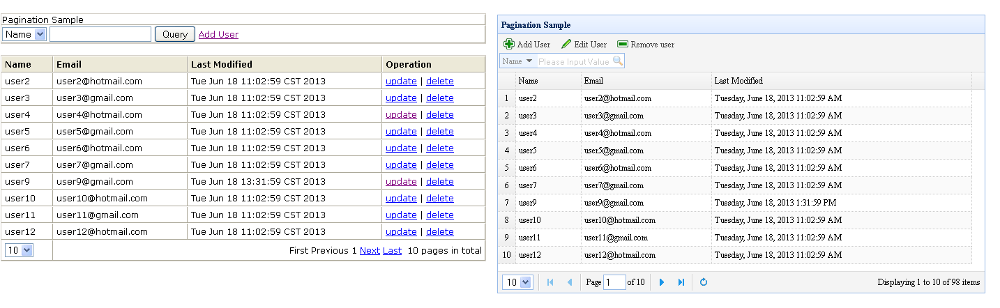

SpLite
============
Introduction
---------------------
SpLite provides a lightweight, integrated and easy-use J2EE development environment with typical use case samples such as basic database manipulation, paginated representation, log, internationalization, uploading, test and so on. The so-called 'SpLite' is a simple combination of two open source project name's abbreviations, <strong>Sp</strong>ring and ORM<strong>Lite</strong> which are the backbones of this project.

Main tools and respective division of work
---------------------
<ol>
<li><a href="http://www.springsource.org/">Spring</a>, dependency injection and inversion of control, web(Spring MVC)</li>
<li><a href="http://ormlite.com/">ORMLite</a>, data persistence, namely Object Relational Mapping</li>
<li><a href="http://logback.qos.ch/">Logback</a>, log</li>
<li><a href="http://junit.org/">JUnit</a>, test framework</li>
<li><a href="http://jquery.com/">JQuery</a>, javascript framework</li>
<li><a href="http://www.gradle.org">Gradle</a>, a build tool that can be considered as a substitution of ANT</li>
<li><a href="http://www.eclipse.org/webtools/">Eclipse WTP</a>, the IDE</li>
<li><a href="http://www.mysql.com/">MySQL</a>, it is the database the project uses by default that can be replaced by other free databases, e.g. PostgreSQL.(MySQL default charset setting, refer to <a href="http://stackoverflow.com/questions/3513773/change-mysql-default-character-set-to-utf8-in-my-cnf">this</a>)</li>
<li><a href="http://tomcat.apache.org/">Tomcat</a>, it is the application server the project uses by default that can be replaced by other servers, e.g. glassfish.(Tomcat charset setting also needs to be considered)</li>
</ol>

How to use
---------------------
<h4>Quick Demonstration</h4>
For a quick demonstration, SpLite uses embedded <a href="http://www.eclipse.org/jetty/">Jetty</a> and <a href="http://www.h2database.com">H2</a> instead of Tomcat and MySQL so that the user does not have to install application server and database. 
<ol>
<li>Configure Gradle 
Download <a href="http://www.gradle.org">Gradle</a> and configure gradle/bin location to system 'path' environment variable.</li>
<li>Prepare SpLite 
Download <a href="https://github.com/wangxu-alvin/web_template/archive/master.zip">SpLite zip file</a> and unzip it to anywhere you like. 
If you are accessing web via a proxy, please copy **/web_template/metadata/gradle.properties to **/web_template/splite and adapt it to your proxy settings.
</li>
<li>Run SpLite 
Run Windows command or Linux terminal, that depends on your system, cd to **/web_template/splite 
Execute the command: gradle jettyRun   At last, you will see some output information like  
> Building > :jettyRun > Running at http://localhost:8080/splite 
Open your web browser and input the address. You can see the page like below: 

</li>
</ol>
<h4>Eclipse WTP Development Environment</h4>
<h4>TODO.</h4>

License
---------------------
Released under the <a href="http://opensource.org/licenses/MIT">MIT license.</a>

Project Status
---------------------
<strong>Currently the project is still in progress</strong>
