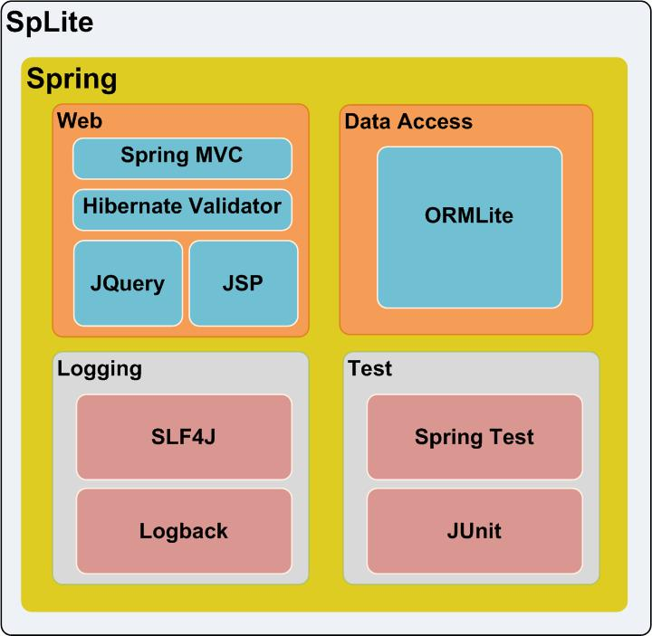

SpLite
============
Introduction
---------------------
SpLite provides a lightweight, integrated and easy-use J2EE development environment with typical use case samples such as basic database manipulation, paginated representation, log, internationalization, uploading, test and so on. The so-called ‘SpLite’ is a simple combination of two open source project name’s abbreviations, <strong>Sp</strong>ring and ORM<strong>Lite</strong> which are the backbones of this project.

Main tools and respective division of work
---------------------
<ol>
<li><a href="http://www.springsource.org/">Spring</a>, dependency injection and inversion of control, web(Spring MVC)</li>
<li><a href="http://ormlite.com/">ORMLite</a>, data persistence, namely Object Relational Mapping</li>
<li><a href="http://logback.qos.ch/">Logback</a>, log</li>
<li><a href="http://junit.org/">JUnit</a>, test framework</li>
<li><a href="http://jquery.com/">JQuery</a>, javascript framework</li>
<li><a href="http://www.gradle.org">Gradle</a>, a build tool that can be considered as a substitution of ANT</li>
<li><a href="http://www.eclipse.org/webtools/">Eclipse WTP</a>, the IDE</li>
<li><a href="http://www.mysql.com/">MySQL</a>, it is the database the project uses by default that can be replaced by other free databases, e.g. PostgreSQL.</li>
<li><a href="http://tomcat.apache.org/">Tomcat</a>, it is the application server the project uses by default that can be replaced by other servers, e.g. glassfish.</li>
</ol>

How to use
---------------------
TODO.

License
---------------------
TODO

Project Status
---------------------
<strong>Currently the project is still in progress</strong>
